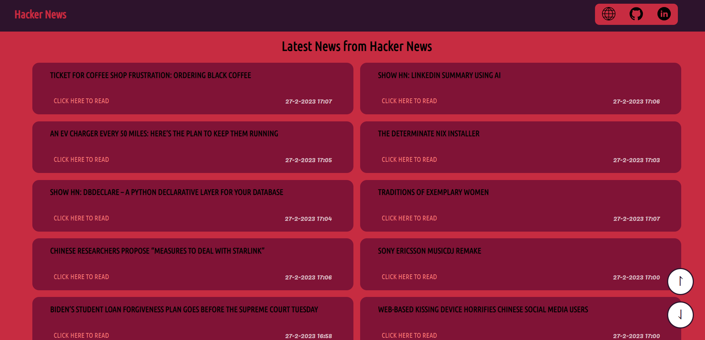
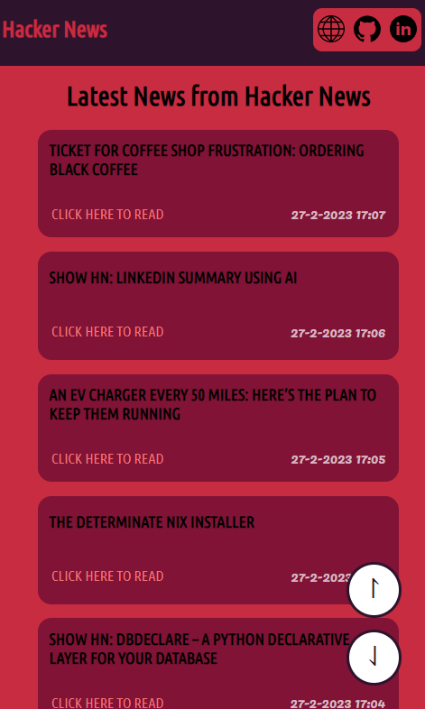

<h1> HackerNews </h1>

Javascript Advanced Project for Full Stack Development course of [start2impact](https://www.start2impact.it).
I take the news from API: https://github.com/HackerNews/API.  
Live demo: https://hackernewsinfo.netlify.app/

<h2>Table of Contents</h2>

- [Technologies Used](#ciao)
- [Features](#features)
- [Screenshots](#screenshots)
- [Contact](#contact)

<h3>Technologies Used</h3>

- HTML 5 &nbsp; 
- CSS &nbsp; 
- SASS &nbsp; 
- Javascript &nbsp; 
- Webpack &nbsp; 

## Features

- Show the last 10 news in a card, with title, link and publication time
- click on the "load more" button, another 10 newswill be displayed

## Screenshots

<h4>Desktop View</h4> 

<h4>Mobile View</h4> 

## Contact

Created by Marco Giuliani: &nbsp; 

- [Website](https://marcogiu.github.io/myWebsite/) &nbsp; 
- [Linkedin](https://www.linkedin.com/in/marco-giuliani-2a20b4179/) &nbsp; 
- [Twitter](https://twitter.com/Marco02351182) &nbsp; 
